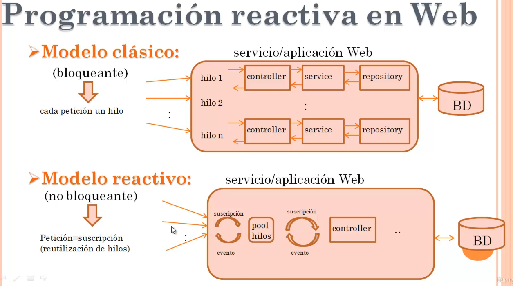
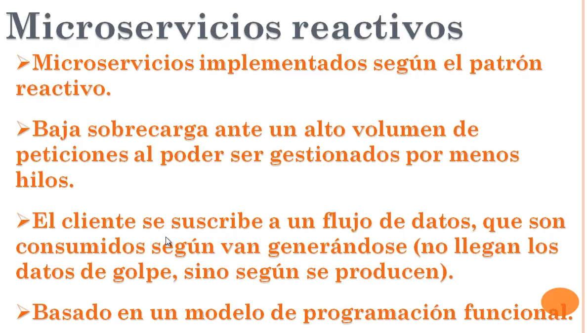
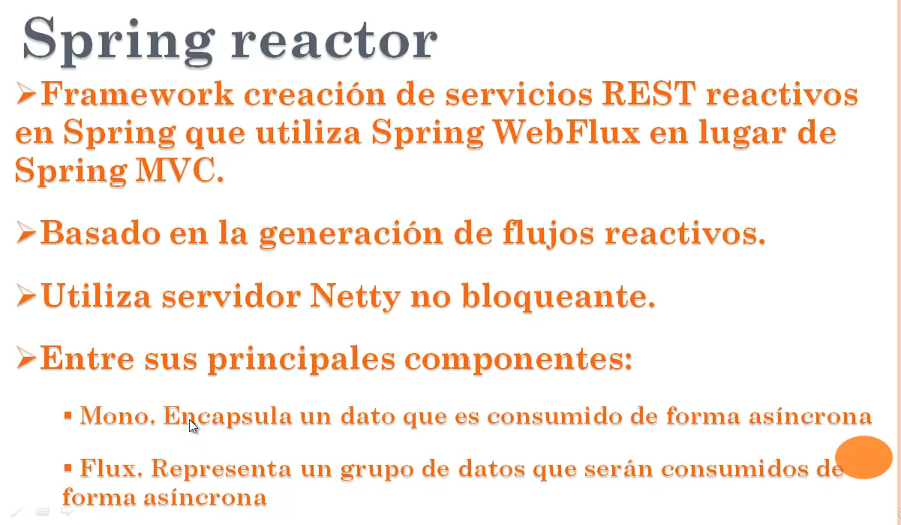
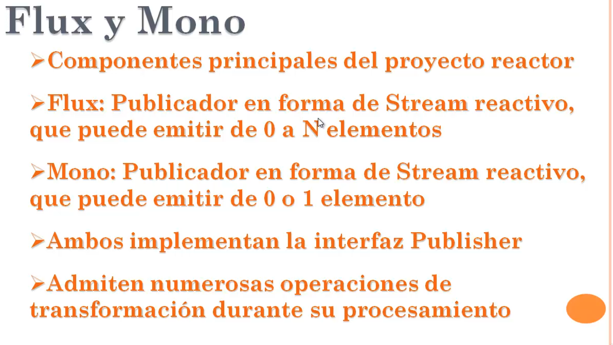
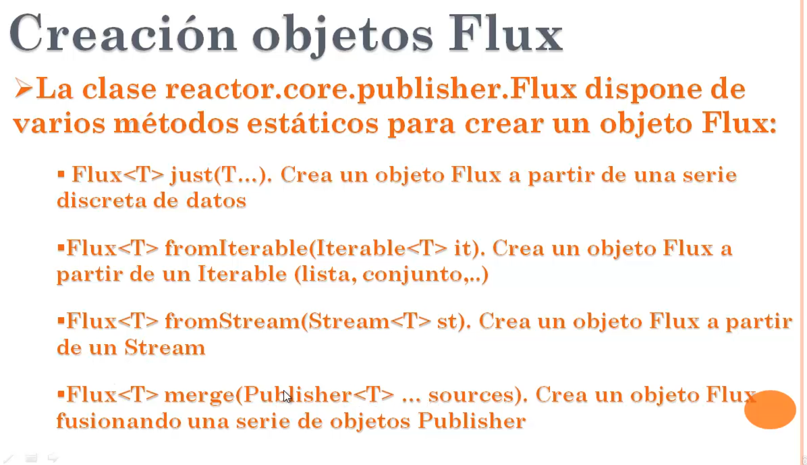
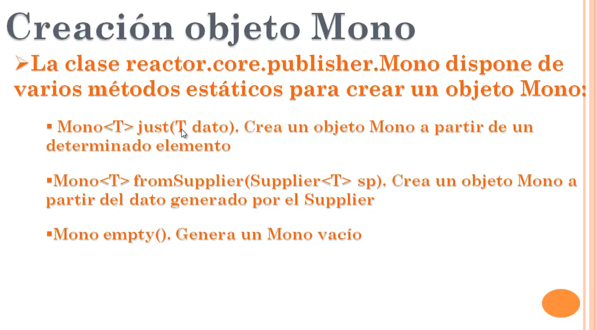
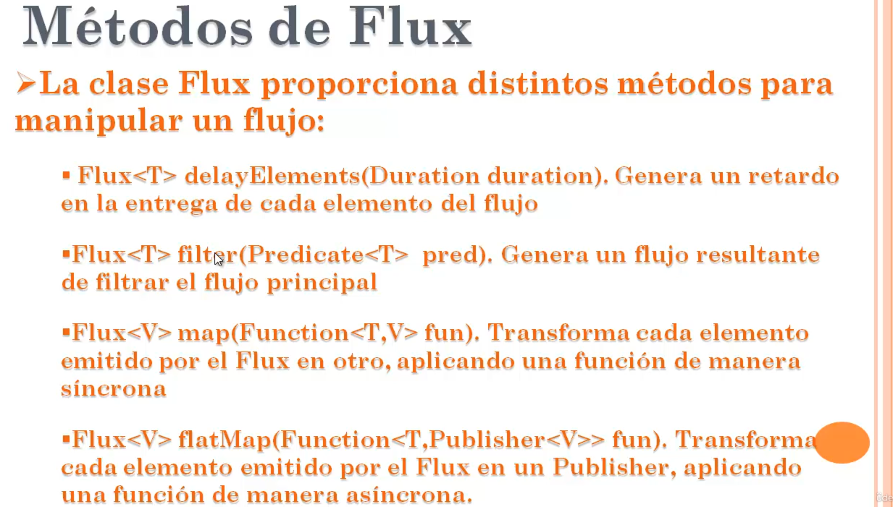
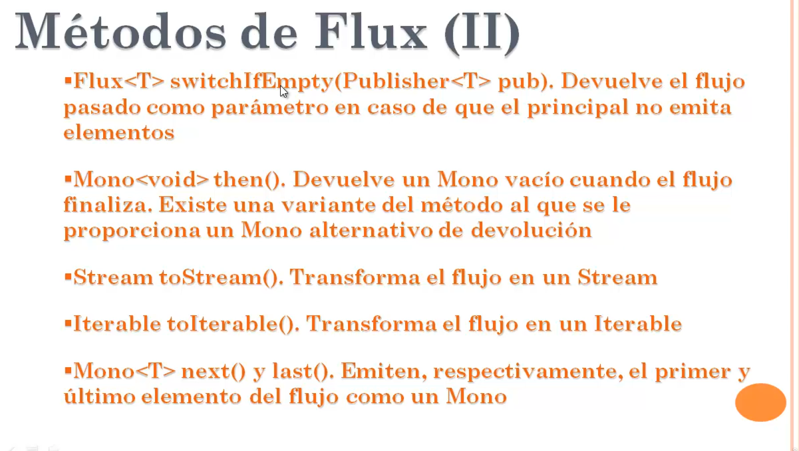

# reactive-programming-architecture-spring-webflux

## Descripción

## Elementos más utilizados

## Tipo de configuración

¿Cuál elegir?
- Usa record si necesitas un objeto simple, inmutable y solo para almacenar datos (ejemplo: DTOs o respuestas de API).
- Usa Lombok si trabajas con clases más complejas, necesitas mutabilidad, herencia o quieres personalizar el comportamiento fácilmente.

### Guia

* [Official Apache Maven documentation](https://projectreactor.io/docs)
